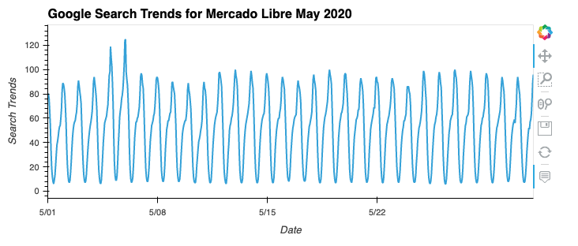
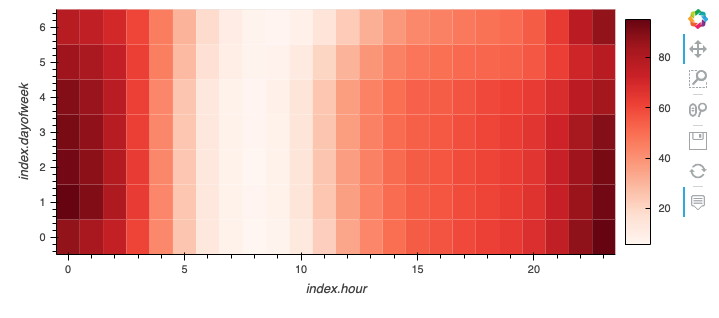
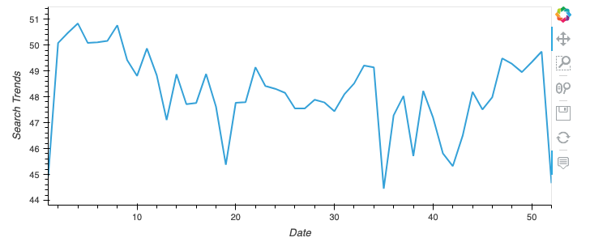
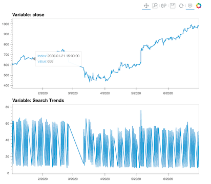
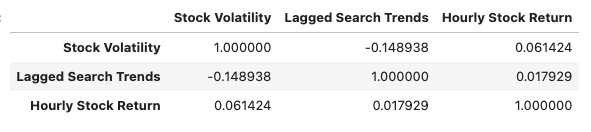

# Mercado_Libre
This project exemplifies how the Prophet model can be used to forecast future business revenue by finding correlation in stock price and google search traffic to a business site during the same time period. This example project looks at the search traffic on the e-commerce website Mercado Libre which operates in South America.

# Technologies
Python implementation: CPython
Python version       : 3.7.13
IPython version      : 7.31.1

# Packages and Libraries
pandas
numpy 
holoviews 
prophet
hvplot
datetime
pathlib
matplotlib

# Procedure Outline
1. Gathering Data and Finding Unusal Patterns

2. Narrow down Data to specific Events

3. Relate the Search Traffic to Stock Patterns

4. Create a Timeseries Model with Prophet

5. Forecast Revenu by using Timeseries Modeling

# Step 1: Gathering Data and Finding Unusal Patterns
**Data for this project is located in the Resources Folder**
1- Data is imported from the csv files using pandas read_csv with a path to google_hourly_search_trends.csv
2- The data is displayed in a dataframe for general layout then sliced to take a closer look at May of 2020



3- The May 2020 search data is compared to the median monthly search data to help identify the pattern of higher than average traffic in May 2020. This inforamtion gives us a place to start looking into seasonality of patterns or events in the next section.

'traffic_may_2020 / median_monthly_traffic'

# Step 2: Narrow down Data to Specific Events

1- Armed with hourly search data from Google, we look for sesonality in days per week and time of day.
```groupby_weekday = [df_mercado_trends.index.dayofweek, df_mercado_trends.index.hour]
weekday_avg = df_mercado_trends.groupby(groupby_weekday).mean()
```

`df_mercado_trends.hvplot.heatmap(x='index.hour', y='index.dayofweek', C='Search Trends', cmap='reds').aggregate(function=np.mean)
`


2- The heatmap visual of weekly and hourly patterns shows a distinct bias toward searches happening after normal working hours on weekdays, and early evenings on Sunday.

3- The data is then plotted to look for seasonal patterns around the winter holiday.  As would be expected, traffic in e-commerce increases Oct-Dec.



# Step 3: Relate Search Traffic to Stock Patterns
1- Data is imported from the csv files using pandas read_csv with a path to mercado_stock_price.csv
2- The dataframe is again viewed and plotted for layout and possible trends, before being concatonated with the search trends dataframe used in Step 2.

`mercado_stock_trends_df = pd.concat([df_mercado_stock, df_mercado_trends], axis=1).dropna()`

3- The combined dataframe is evaluted and visualized with a focus on the early 1/2 of 2020 to see if stock price had a relationship to the search trends. 
4- The side-by-side visualizaions show a distinct pattern in the relationship between the two in the early half of 2020, particularly in March of 2020 when the pandemic lockdowns began.




5- Finally the calculations were made to figure out the Stock Volatility, Lagged Search Trends, and the Hourly Stock Return. These values were added in columns to the dataframe.

6- The final analysis calculated the correlation between the Stock Volatility, Lagged Search Trends and Hourly Stock Return. Which indicated there was a slight, 14%, inverse correlation between the Lagged Search Trends and Stock Volatility, and a 6% direct correlation betweend the Lagged Search Trends and Hourly Stock Return.

`mercado_stock_trends_df[['Stock Volatility', 'Lagged Search Trends', 'Hourly Stock Return']].corr()`



# Step 4: Create a Timeseries Model with Prophet
1-